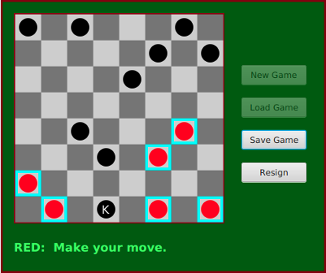

= Programming Exercises for Chapter 11

* Exercise 1
** Write a modified version of `DirectoryList` that will list all the files in a directory and all its subdirectories, to any level of nesting. You will need a recursive subroutine to do the listing. The subroutine should have a parameter of type `File`.

[source, java]
----
public File( File dir, String fileName )
   // Constructs the File object representing a file
   // named fileName in the directory specified by dir.
----

---

* Exercise 2
** Write a program that will count the number of lines in each file that is specified on the command line. Assume that the files are text files
** Write each file name, along with the number of lines in that file, to standard output. If an error occurs while trying to read from one of the files, you should print an error message for that file, but you should still process all the remaining files.

    java  LineCounts  file1.txt  file2.txt  file3.txt

---

* Exercise 3
** The program is a simple file server that makes a collection of files available for transmission to clients. When the server starts up, it needs to know the name of the directory that contains the collection of files. This information can be provided as a command-line argument. 
** You can assume that the directory contains only regular files (that is, it does not contain any sub-directories). You can also assume that all the files are text files.
** When a client connects to the server, the server first reads a one-line command from the client. The command can be the string "INDEX". In this case, the server responds by sending a list of names of all the files that are available on the server. Or the command can be of the form "GET <filename>", where <filename> is a file name. The server checks whether the requested file actually exists. If so, it first sends the word "OK" as a message to the client. Then it sends the contents of the file and closes the connection. Otherwise, it sends a line beginning with the word "ERROR" to the client and closes the connection.

---

* Exercise 4
** Write a client program for the server from Exercise 11.3. Design a user interface that will let the user do at least two things: 
*** (1) Get a list of files that are available on the server and display the list on standard output; *** (2) Get a copy of a specified file from the server and save it to a local file

---

* Exercise 5
** Modify that program `PhoneDirectoryFileDemo.java` so that it uses an XML format for the data. The only significant changes that you will have to make are to the parts of the program that read and write the data file. Use the DOM to read the data, as discussed in `Subsection 11.5.2`.

[source, xml]
----
<?xml version="1.0"?>
<phone_directory>
  <entry name='barney' number='890-1203'/>
  <entry name='fred' number='555-9923'/>
</phone_directory>
----

---

* Exercise 6
** Design a simple text-based format for the files. Here is a picture of my solution to this exercise, showing that Load and Save buttons have been added
** you can use the following code to set up the remaining program state correctly. This code assumes that you have introduced two new variables saveButton and loadButton of type Button to represent the "Save Game" and "Load Game" buttons

[source, java]
----
board = newBoard;  // Set up game with data read from file.
currentPlayer = newCurrentPlayer;
legalMoves = board.getLegalMoves(currentPlayer);
selectedRow = -1;
gameInProgress = true;
newGameButton.setDisable(true);
loadButton.setDisable(true);
saveButton.setDisable(false);
resignButton.setDisable(false);
if (currentPlayer == CheckersData.RED)
   message.setText("Game loaded -- it's RED's move.");
else
   message.setText("Game loaded -- it's BLACK's move.");
drawBoard();
----