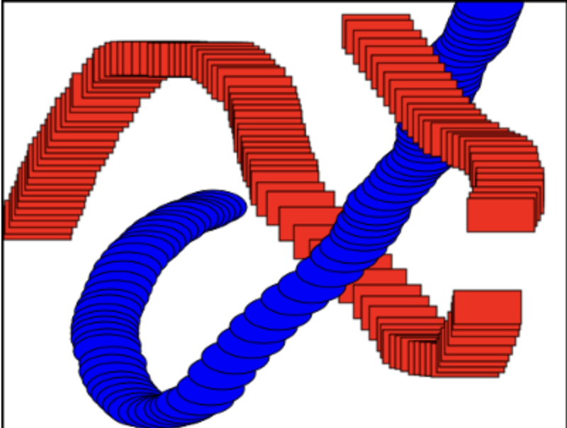
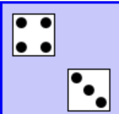
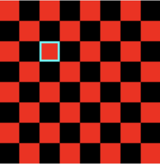
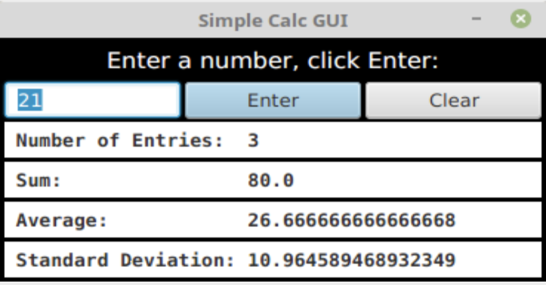
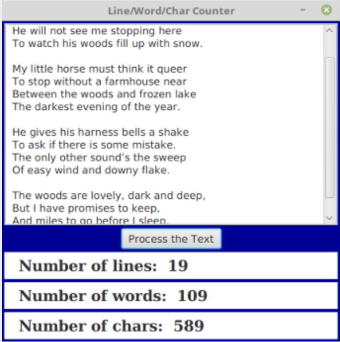
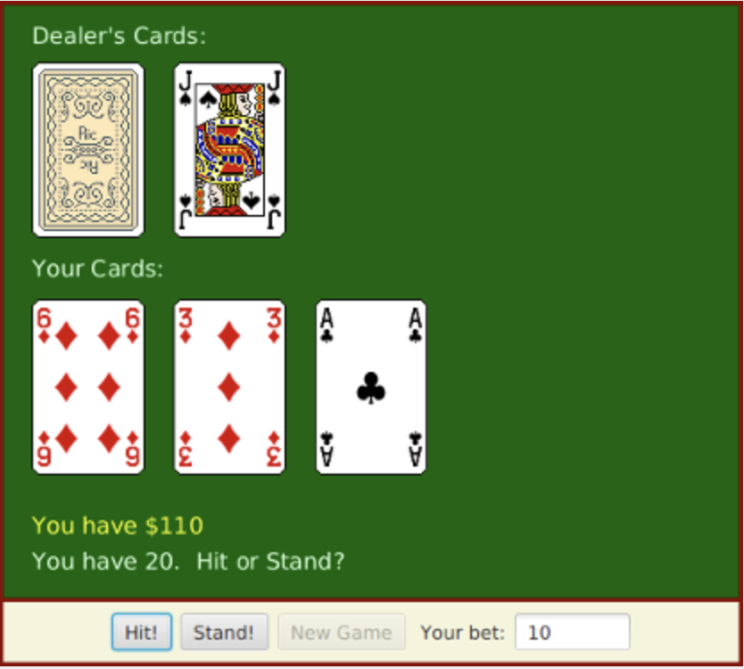

= Programming Exercises for Chapter 6

* Exercise 6.1:

[source, java]
----
canvas.setOnMousePressed( evt -> {
    GraphicsContext g = canvas.getGraphicsContext2D();
    if ( evt.isShiftDown() ) {
        g.setFill( Color.BLUE );
        g.fillOval( evt.getX() - 30, evt.getY() - 15, 60, 30 )
    }
    else {
        g.setFill( Color.RED );
        g.fillRect( evt.getX() - 30, evt.getY() - 15, 60, 30 );
    }
} );
----

** Write a complete program that does the same, but in addition, the program will continue to draw figures if the user drags the mouse. That is, the mouse will leave a trail of figures as the user drags. However, if the user right-clicks the canvas, then the canvas should simply be cleared and no figures should be drawn even if the user drags the mouse after right-clicking. 

** Note that a black border has been added around each shape to make them more distinct.

** To make the problem a little more challenging, when drawing shapes during a drag operation, make sure that the shapes that are drawn are at least, say, 5 pixels apart. To implement this, you have to keep track of the position where the previous shape was drawn.

---

* Exercise 6.2:
** Write a program that shows a small red square and a small blue square. The user should be able to drag either square with the mouse. (You'll need an instance variable to remember which square the user is dragging.) The user can drag the square out of the window if she wants, and it will disappear. To allow the user to get the squares back into the window, add a KeyPressed event handler that will restore the squares to their original positions when the user presses the Escape key. The key code for the Escape key is `KeyCode.ESCAPE`.

---

* Exercise 6.3:
** Write a program that shows a pair of dice. The dice are drawn on a `Canvas`. You can assume that the size of the canvas is 100 by 100 pixels. When the user clicks on the canvas, the dice should be rolled (that is, the dice should be assigned newly computed random values). Each die should be drawn as a square showing from 1 to 6 dots. Since you have to draw two dice, its a good idea to write a subroutine, such as "void drawDie(GraphicsContext g, int val, int x, int y)", to draw a die at the specified (x,y) coordinates. The second parameter, val, specifies the number of dots that are showing on the die. Here is a picture of a canvas displaying two the dice

---

* Exercise 6.4:
** In `Exercise 6.3`, you wrote a graphical pair-of-dice program where the dice are rolled when the user clicks on the canvas. Now make a pair-of-dice program where the user rolls the dice by clicking a button. The button should appear under the canvas that shows the dice. Also make the following change: When the dice are rolled, instead of just showing the new value, show a short animation during which the values on the dice are changed in every frame. The animation is supposed to make the dice look more like they are actually rolling.

---

* Exercise 6.5:
** In `Exercise 3.8`, you drew a checkerboard. For this exercise, write a program where the user can select a square by clicking on it. Highlight the selected square by drawing a colored border around it. When the program starts, no square is selected. When the user clicks on a square that is not currently selected, it becomes selected, and the previously selected square, if any, is unselected. If the user clicks the square that is selected, it becomes unselected.

** Assume that the size of the checkerboard is exactly 400 by 400 pixels, so that each square on the checkerboard is 50 by 50 pixels. Here is my checkerboard, with the square in row 3, column 3 selected, shown at reduced size:

---

* Exercise 6.6:
** For this exercise, you should modify the `SubKiller` game from Subsection 6.3.6. You can start with the existing source code, from the file `SubKiller.java`. Modify the game so it keeps track of the number of hits and misses and displays these quantities. That is, every time the depth charge blows up the sub, the number of hits goes up by one. Every time the depth charge falls off the bottom of the screen without hitting the sub, the number of misses goes up by one. There is room at the top of the canvas to display these numbers. To do this exercise, you only have to add a half-dozen lines to the source code. But you have to figure out what they are and where to add them. To do this, you'll have to read the source code closely enough to understand how it works.

---

* Exercise 6.7:
** `Exercise 5.2` involved a class, `StatCalc.java`, that could compute some statistics of a set of numbers. Write a GUI program that uses the `StatCalc` class to compute and display statistics of numbers entered by the user. The program will have an instance variable of type `StatCalc` that does the computations. The program should include a `TextField` where the user enters a number. It should have four labels that display four statistics for the numbers that have been entered: the number of numbers, the sum, the mean, and the standard deviation. Every time the user enters a new number, the statistics displayed on the labels should change. The user enters a number by typing it into the `TextField` and then either clicking an "Enter" button or pressing the Return (or Enter) key. There should be a "Clear" button that clears out all the data. This means creating a new `StatCalc` object and changing the text that is displayed on the labels. (See the discussion of "default buttons" at the end of `Subsection 6.4.2` for one way of implementing a response the Return key.) Here is a picture of my solution to this problem:

** Getting the interface to look just like I wanted it was the hardest part. In the end, I used TilePanes (`Subsection 6.5.4`) for the layout.

---

* Exercise 6.8:
** Write a program that has a `TextArea` where the user can enter some text. The program should have a button such that when the user clicks on the button, the program will count the number of lines in the user's input, the number of words in the user's input, and the number of characters in the user's input. This information should be displayed on three Labels. Recall that if textInput is a `TextArea`, then you can get the contents of the `TextArea` by calling the function `textInput.getText()`. This function returns a String containing all the text from the text area. The number of characters is just the length of this String. Lines in the String are separated by the new line character, '\n', so the number of lines is just the number of new line characters in the String, plus one. Words are a little harder to count. Exercise 3.4 has some advice about finding the words in a `String`. Essentially, you want to count the number of characters that are first characters in words. Here is a picture of my solution:

---

* Exercise 6.9:
** Write a program that lets the user draw polygons. As the user clicks a sequence of points in a Canvas, count the points and store their `x- and y-coordinates` in two arrays. These points will be the vertices of the polygon. As the user is creating the polygon, you should just connect all the points with line segments. When the user clicks near the starting point, draw the complete polygon. Draw it with a red interior and a black border. Once the user has completed a polygon, the next click should clear the data and start a new polygon from scratch.

---

* Exercise 6.10:
** Write a GUI Blackjack program that lets the user play a game of Blackjack, with the computer as the dealer. The program should draw the user's cards and the dealer's cards, just as was done for the graphical HighLow card game in `Subsection 6.6.1`. You can use the source code for that game, `HighLowGUI.java`, for some ideas about how to write your Blackjack game. The structures of the HighLow program and the Blackjack program are very similar. You will certainly want to use the `drawCard()` method from the HighLow program.

---

* Exercise 6.11:
** In the Blackjack game from Exercise 6.10, the user can click on the "Hit", "Stand", and "NewGame" buttons even when it doesn't make sense to do so. It would be better if the buttons were disabled at the appropriate times. The "New Game" button should be disabled when there is a game in progress. The "Hit" and "Stand" buttons should be disabled when there is not a game in progress. The instance variable gameInProgress tells whether or not a game is in progress, so you just have to make sure that the buttons are properly enabled and disabled whenever this variable changes value. I strongly advise writing a method that can be called every time it is necessary to set the value of the gameInProgress variable. That method can take full responsibility for enabling and disabling the buttons (as long as it is used consistently). Recall that if bttn is a variable of type Button, then bttn.setDisable(true) disables the button and bttn.setDisable(false) enables the button.

** As a second (and more difficult) improvement, make it possible for the user to place bets on the Blackjack game. When the program starts, give the user $100. Add a TextField to the strip of controls along the bottom of the panel. The user enters the bet in this TextField. When the game begins, check the amount of the bet. You should do this when the game begins, not when it ends, because several errors can occur: The contents of the TextField might not be a legal number, the bet that the user places might be more money than the user has, or the bet might be <= 0. You should detect these errors and show an error message instead of starting the game. The user's bet should be an integral number of dollars.

** It would be a good idea to make the TextField uneditable while the game is in progress. If betInput is the TextField, you can make it editable and uneditable by the user with the commands betInput.setEditable(true) and betInput.setEditable(false).

** In the drawBoard() method, you should include commands to display the amount of money that the user has left.

** There is one other thing to think about: Ideally, the program should not start a new game when it is first created. The user should have a chance to set a bet amount before the game starts. So, in the start() method, you should not call doNewGame(). You might want to display a message such as "Welcome to Blackjack" before the first game starts.

